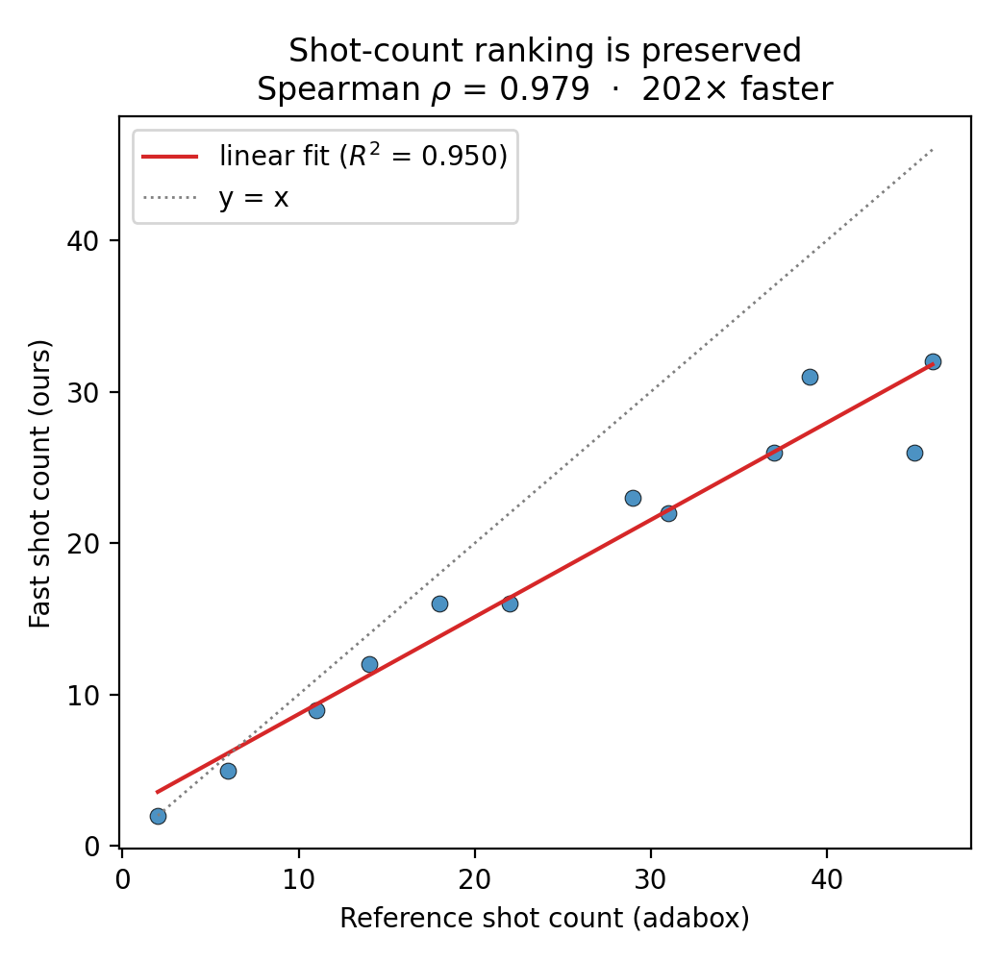

<div align="center">

# LithoGRPO: Fast Inverse Lithography via GRPO-Reinforced Flow Matching

[](https://arxiv.org/abs/2606.00228)
[](https://icml.cc/virtual/2026/poster/61189)
[](https://huggingface.co/laiyao1/LithoGRPO)
[](LICENSE)

</div>

> Official implementation of **"LithoGRPO: Fast Inverse Lithography via GRPO-Reinforced Flow Matching"** (ICML 2026).

---

## TL;DR

**LithoGRPO** is the first framework to unify **flow matching** with **GRPO-based reinforcement learning** for inverse lithography technology (ILT). By treating the physics-based, explicitly-defined ILT objective as a reward signal, LithoGRPO fine-tunes a generative mask synthesizer to produce manufacturable photomasks that are faster and higher-quality than prior optimization-based and learning-based approaches.

- 🧩 **Flow Matching + RL** — a generative flow-matching prior for mask synthesis, fine-tuned with **Group Relative Policy Optimization (GRPO)** against the physics-based ILT reward.
- ⚡ **Orders-of-magnitude faster shot counting** — a fast shot-counting algorithm that preserves the mask ranking while greatly accelerating manufacturability evaluation (up to ~130× in our paper's setting; the exact factor depends on hardware and mask resolution).
- 🏆 **State of the art** — improved printability and manufacturability versus leading ILT and learning-based baselines.

---

## Description

Inverse lithography technology (ILT) computes a photomask whose optical projection, after passing through the diffraction-limited lithography system, best reproduces a target circuit layout. It is one of the most powerful — and most computationally expensive — resolution enhancement techniques in modern semiconductor manufacturing.

LithoGRPO reframes mask optimization as a **reward-guided generative process**:

1. A **flow-matching** model learns a strong prior over high-quality masks.
2. **GRPO** reinforcement-learning fine-tuning steers generation toward the explicitly defined, physics-based ILT reward (printability, process-window robustness, and manufacturability).
3. A **fast shot-counting** algorithm makes the manufacturability term of the reward cheap enough to use inside the RL loop, giving a large speedup (up to ~130× in our evaluation) while preserving the relative ranking of candidate masks.

This combination delivers masks that are both faster to generate and more manufacturable than previous optimization-based and end-to-end learning-based methods.

---

## Release status

This repository is being open-sourced incrementally. **Currently released:**

- [x] **Fast shot counting** — `FastShotCounter` (ours) and the `ShotCounter` reference baseline, plus the comparison/plotting example.

**TODO (coming soon):**

- [ ] GRPO reinforcement-learning fine-tuning code
- [ ] Flow-matching prior (training + pretrained checkpoints)
- [ ] Physics-based ILT reward and lithography simulator
- [ ] End-to-end inference / mask-optimization pipeline
- [ ] Datasets and evaluation scripts

Stars and issues are welcome to track progress.

---

## Installation

```bash
# 1. Clone the repository
git clone git@github.com:laiyao1/LithoGRPO.git
cd LithoGRPO

# 2. Create an environment (conda recommended)
conda create -n litho python=3.14 -y
conda activate litho

# 3. Install dependencies
pip install -r requirements.txt
```

Tested with **Python 3.14**, **PyTorch 2.9** (CUDA), and **NumPy 2.x**.

---

## Fast shot counting

Shot count — the number of rectangular e-beam exposures needed to write a mask —
is a key manufacturability metric. The exact decomposition (LithoBench's adabox
counter) is accurate but too slow to use inside an RL reward loop, so LithoGRPO
introduces a **fast shot counter**: it enumerates maximal all-ones rectangles and
solves a minimum set-cover ILP. It is **much faster** while **preserving the mask
ranking** (Spearman ρ ≈ 1.0) of the reference counter — up to ~130× in our paper's
setting, though the exact factor depends on hardware, mask resolution, and the ILP
solver. The script below reports the speedup actually measured on your machine.

This is the first module released in this repo. Both counters are available:

```python
import torch
from shotcount import FastShotCounter, ShotCounter

mask = (torch.rand(256, 256) > 0.5).float()   # a binary mask

fast = FastShotCounter().run(mask, shape=(256, 256))   # ours (much faster)
ref  = ShotCounter().run(mask, shape=(256, 256))       # adabox reference
print(fast, ref)
```

### Reproduce the correlation plot

The example script generates masks of varying complexity, runs both counters,
and plots their correlation and speedup:

```bash
PYTHONPATH=. python examples/compare_shots.py --num 12 --size 128 --seed 1 --out assets/shot_correlation.png
```

<p align="center">
  
</p>

The fast counter tracks the reference ranking almost perfectly while running
orders of magnitude faster.

> 🔜 The flow-matching prior, GRPO fine-tuning, and inference pipeline will be
> released next.

---

## Repository structure

```
LithoGRPO-open/
├── shotcount/          # Shot counting
│   ├── fast.py         #   FastShotCounter — maximal-rectangle + ILP cover (ours)
│   └── reference.py    #   ShotCounter — adabox decomposition (LithoBench baseline)
├── adabox/             # Vendored rectangular decomposition (MIT, see adabox/LICENSE)
├── examples/
│   └── compare_shots.py  # Fast vs. reference comparison → shot_correlation.png
├── assets/             # Figures
└── requirements.txt
```

---

## Results

LithoGRPO achieves state-of-the-art mask quality while substantially reducing optimization cost. See the [paper](https://arxiv.org/abs/2606.00228) for full quantitative comparisons on standard ILT benchmarks (L2 error, PV-band, EPE) and the shot-counting speedup measurements.

---

## Citation

If you find this work useful, please cite:

```bibtex
@inproceedings{lai2026lithogrpo,
  title     = {LithoGRPO: Fast Inverse Lithography via GRPO-Reinforced Flow Matching},
  author    = {Lai, Yao and Xiong, Xuyuan and Xue, Zeyue and Chen, Guojin and
               Wang, Jing and Liu, Xihui and Zhang, Rui and Mullins, Robert and
               Yu, Bei and Luo, Ping},
  booktitle = {International Conference on Machine Learning (ICML)},
  year      = {2026},
  url       = {https://arxiv.org/abs/2606.00228}
}
```

---

## Related work

- **LithoBench** — Benchmark and toolkit for ILT / OPC; our reference shot counter and evaluation build on it: [github.com/shelljane/lithobench](https://github.com/shelljane/lithobench)
- **adaptive-boxes** — Rectangular decomposition of binary images, used by the reference counter: [github.com/jnfran92/adaptive-boxes](https://github.com/jnfran92/adaptive-boxes)

---

## Acknowledgements

The reference shot counter and evaluation pipeline build on [LithoBench](https://github.com/shelljane/lithobench), and the rectangular decomposition it relies on is vendored from the MIT-licensed [adaptive-boxes](https://github.com/jnfran92/adaptive-boxes) (`adabox/`, see `adabox/LICENSE`). We thank the authors of these projects and the broader open-source lithography and generative-modeling communities.

---

## License

This project is released under the [MIT License](LICENSE).
